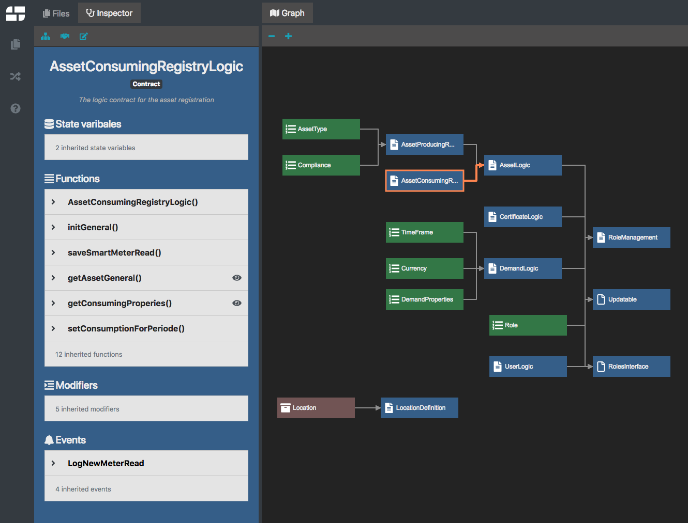
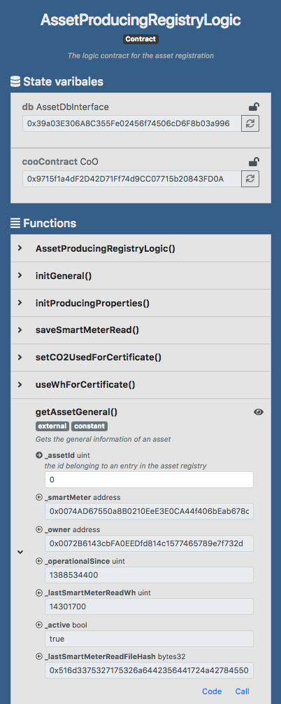
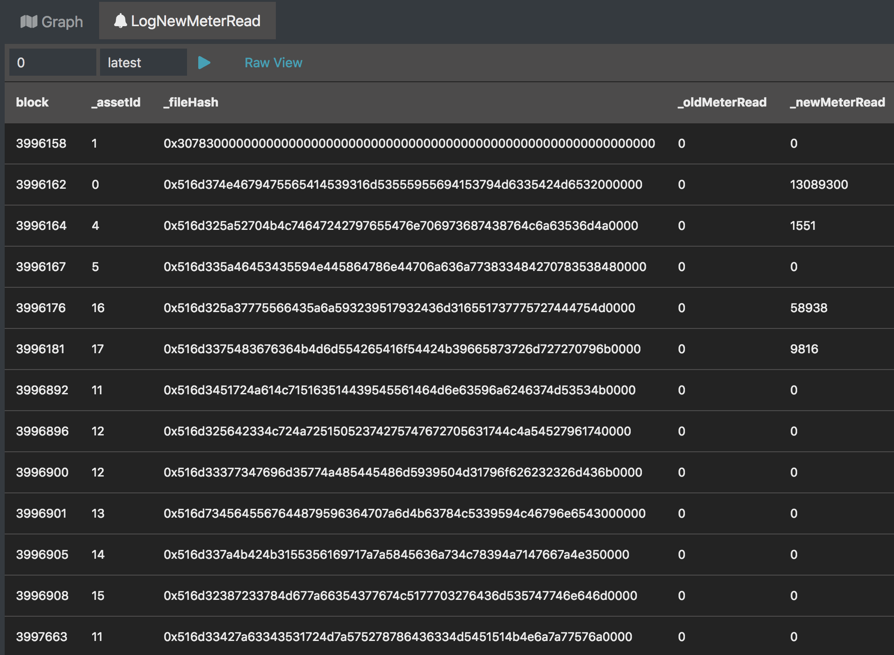
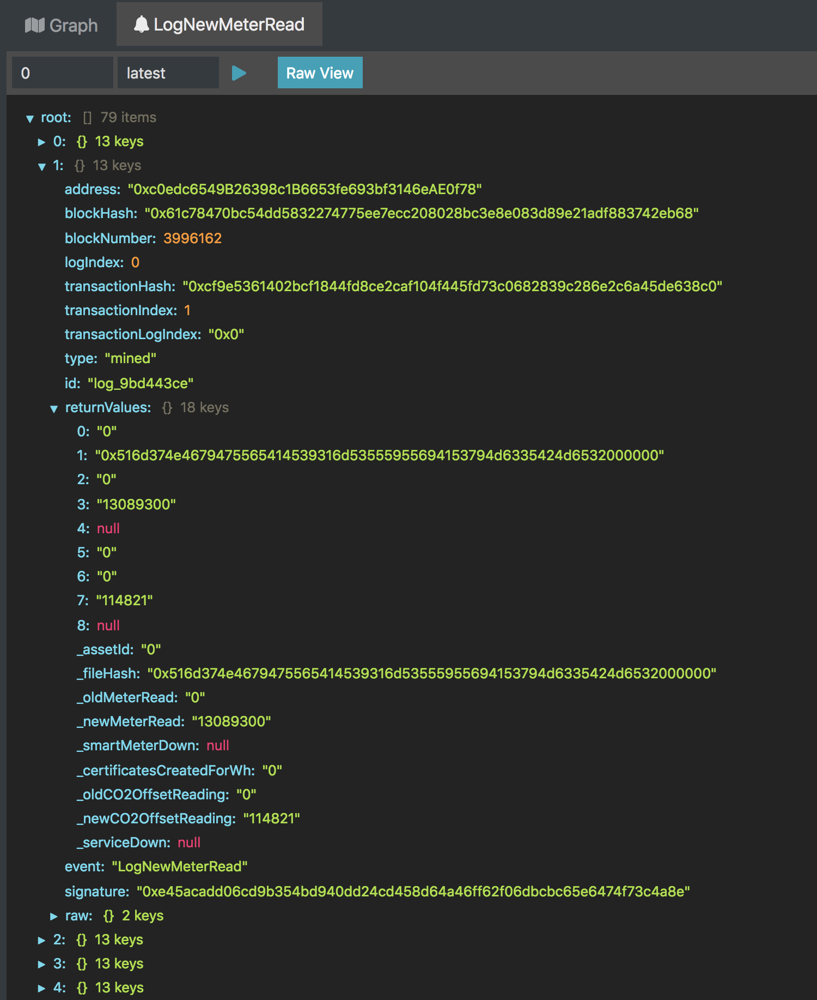

# Piet
A tool helping to grasp solidity smart contract architectures.

## Abstract
Piet is a web application providing support to understand smart contract architectures. 
This is approached by generating a graphical representation of such architectures and a possibility to query deployed instances of smart contracts.

The graphical representation shows the inheritance structure of solidity contracts. In addition to the inheritance structure the defined enumerations and structs are shown.

To provide understanding of one single solidity contract Piet offers an inspector view showing all members of the contract including the inherited ones.
The presentation of the contract and the contract members is enriched by documentation labels derived from Ethereum NatSpec tags.

Piet also provides an interactive mode enabling to read the state of a smart contract, sending transactions and browsing through events. This is achieved by connecting to deployed smart contracts through an injected web3 object.  

## Feature List
- Graphical representation of smart contract architectures
  - Inheritance structure of contracts
  - Shows structs and enums
- Smart contract inspector
  - Shows structure of a smart contract (e.g. functions, events, ...)
  - Shows inherited members
  - Convenient representation of solidity code documentation
- Interactive Mode
  - Read state from blockchain (e.g. state variables, view functions) 
  - Send transactions
  - Show events 
- Solidity code viewer 

## Usage
Type `npm i` followed by `npm start` to start a local instance of Piet at [http://localhost:3001](http://localhost:3001 ) 

## Screenshots 

### Smart contract inspector

### Events

### Events Raw

## Name
The main feature of Piet is to provide a graphical representation of smart contract architectures consisting mostly of rectangles and lines on a canvas. 
So I decided to name this software after Piet Mondrian who seems to be a pioneer in doing this ;)
